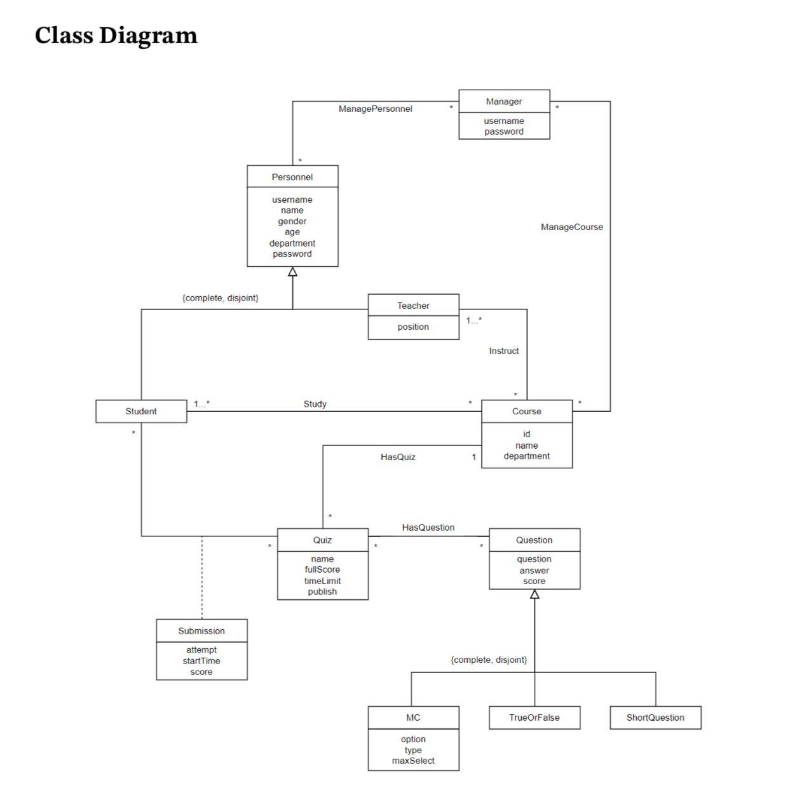
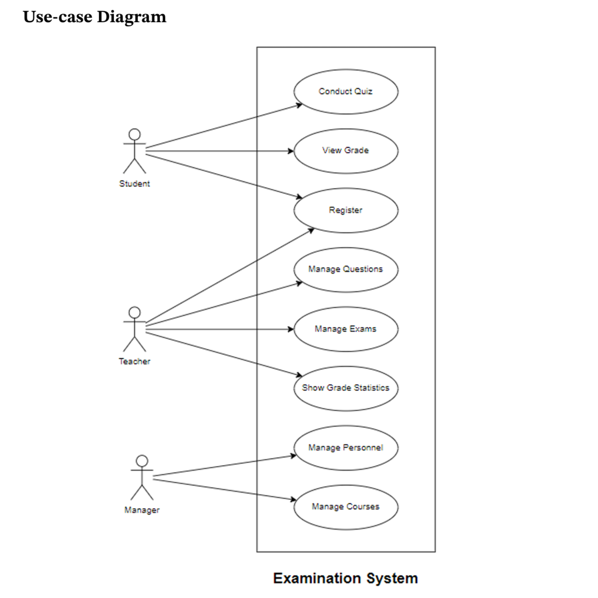
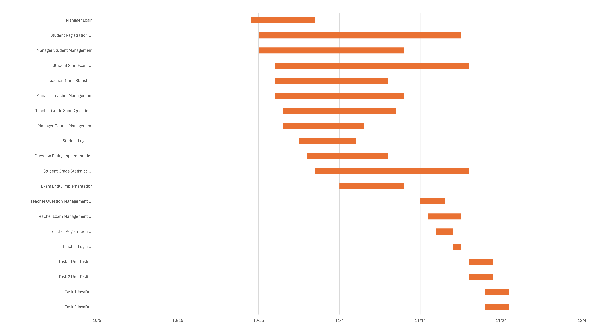
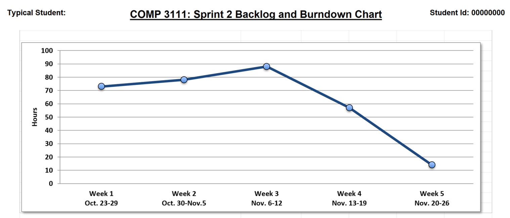

# Exam Management System

A system developed using JavaFX for teachers managing and marking exams
and student doing exams. This is a software engineering course group project, 
which involves a full walkthrough of software development cycles, 
including designing, implementing, testing and documentation.

## Technology Used
- Platform: IntelliJ
- Framework: JavaFX
- Programming Language: Java
- Mischellenous: GSON Library, JSON File Format

## UML Modeling 
| Name                   | Diagram                                                | Name                   | Diagram                                                |
|------------------------|--------------------------------------------------------|------------------------|--------------------------------------------------------|
| Class Diagram          |        | Use-case Diagram       |  |

For use-case sepcification, visit [here](uml_modeling/uml_modeling.pdf)

## Documentation
| Use-case | Link |
| - | - |
| System Documentation | Visit  in browser |
| Student | Visit [here](documentation/student_documentation.pdf) |

## Work Distribution
| Name                   | Diagram                                  | Name                   | Diagram                                  |
|------------------------|------------------------------------------|------------------------|------------------------------------------|
| Gantt Chart            |        | Burndown Chart         |  |

